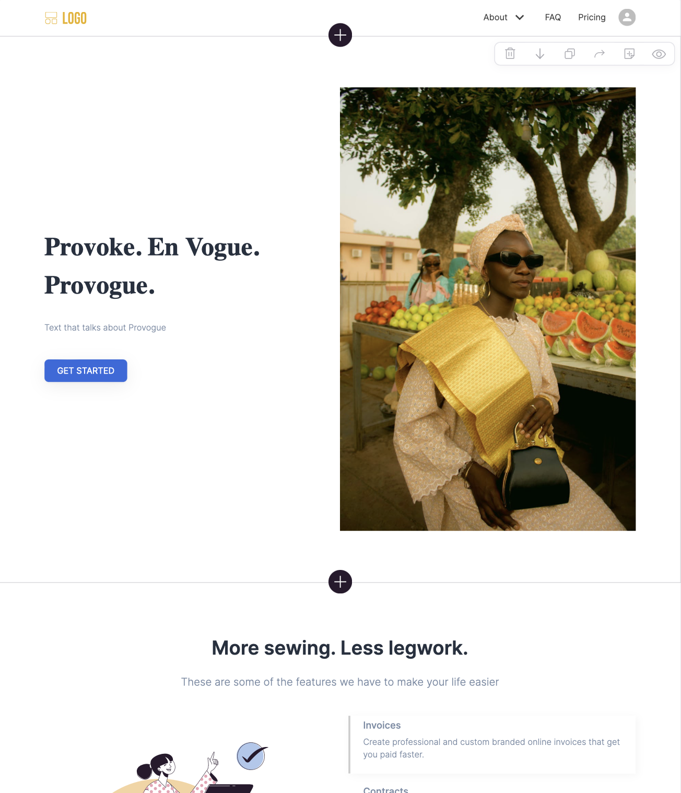

# Provogue

## Slogan

Provoke. En Vogue. Provogue.

## Overview

**Provogue: Streamlining Tailoring and Client Engagement**

Provogue is an innovative web application designed to revolutionize the way tailors manage bookings, client interactions, and projects. This platform allows tailors to focus on their craft by handling the operational aspects of business management seamlessly. For clients, Provogue provides a dynamic platform to easily monitor projects, provide specifications, and book services, making it the ideal solution for optimizing every aspect of the tailoring experience.

### Problem Statement

Provogue aims to alleviate the administrative burdens placed on tailors, enabling them to dedicate more time to creating exquisite garments. The platform addresses the need for an efficient, streamlined approach to managing the various mundane tasks necessary for running a successful tailoring business.

### User Profiles

The web app is designed for two main user groups:

- **Tailors**: Professionals looking for an efficient way to manage client bookings, projects, and business operations.
- **Clients**: Individuals seeking tailored services, with the ability to track projects, make bookings, and interact seamlessly with tailors.

### Features

- **Tailor Dashboard**: Central hub for tailors to manage clients, projects, and business metrics.
- **Client and Tailor Accounts**: Distinct account functionalities that cater to the specific needs of each user type.
- **Authentication**: Secure login and registration processes for tailors and clients.
- **Dynamic Project Tracking**: Real-time updates and notifications for ongoing projects.
- **More Features to Come**: Continued enhancements to improve user experience and expand functionalities.

### Tech Stack

- **Frontend**: ReactJS, SASS for styling.
- **Backend**: Node.js with Express.
- **Database**: MySQL managed through Knex.
- **Additional Libraries**: Specific libraries and tools used to enhance performance and UX will be listed here.

### APIs

Custom APIs developed for this project include:

- **GET /tailors/:id/clients**: Fetch a list of a tailor's clients.
- **GET /tailors**: Fetch all tailors.
- **GET /tailors/:id**: Fetch specific tailor details.
- **GET /tailors/:id/projects**: Retrieve projects associated with a tailor.
- **POST /tailors/login**: Handle tailor login.

### Sitemap

- **Home Page**: Introduction and overview of the app.
- **Login Page**: User login for accessing personalized features.
- **Registration Page**: Account creation for new users.
- **Tailor Dashboard**: Main interface for tailor operations.
- **Client Profile**: Dashboard for clients to manage bookings and view project status.
- **About Page**: Information about the app's purpose and creators.

### Mockups

### Data Schema

### Endpoints

- **"/"**: Home page
- **"/tailor/:id"**: Tailor dashboard
- **"/tailor/:id/clients"**: Tailor’s client list
- **"/register"**: Signup/Registration page
- **"/login"**: Login page
- **"/about"**: About page

### Authentication

Implementation details about authentication and security measures.

## Roadmap

Immediate next steps include the development of the front end to ensure a basic functional product is ready for initial testing and feedback.

## Nice-to-Haves

Future enhancements under consideration:

- **Client Dashboard**: Comprehensive overview for clients to manage their engagements.
- **Advanced Booking System**: For clients to schedule appointments.
- **Financial Tools**: Including invoice and receipt generation for tailors.
- **Enhanced Communication Features**: Improved messaging and notifications.
